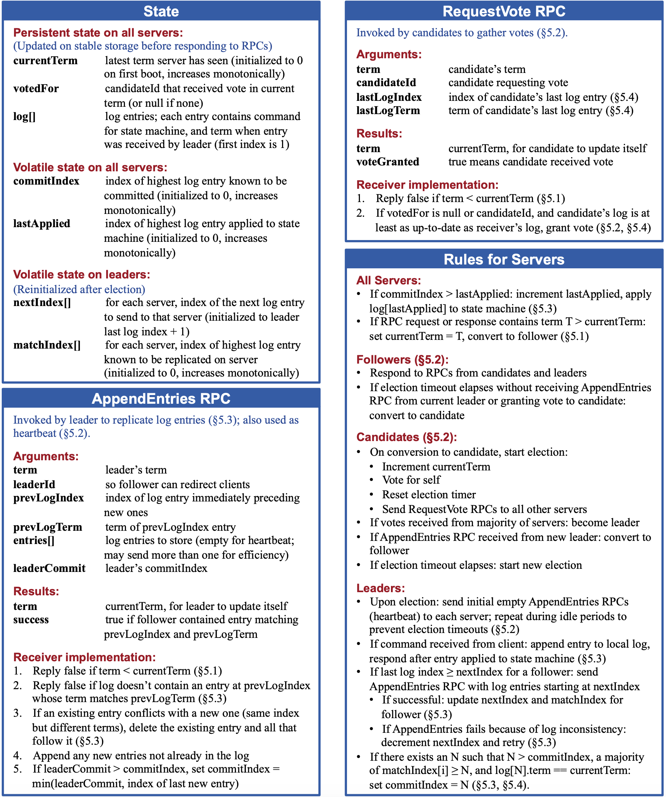

## 一致性算法背景

一致性算法的目的是保证复制日志的一致性。
服务器上接收客户端发送的指令然后添加到自己的日志中，并与其他服务器进行通信确保每个服务器上的日志最终都以相同的顺序包含相同的请求，即使有些服务器发生故障。一旦指令被正确的复制，每一个服务器的状态机按照日志顺序处理他们，然后输出结果被返回给客户端。因此，服务器集群看起来形成了一个高可靠的状态机。

## Raft 协议

Raft 通过选举出一个领导者，由领导者管理复制日志来实现一致性。

领导者从客户端接收日志条目（log entries），把日志条目复制到其他服务器上，并告诉其他服务器什么时候可以安全地将日志条目应用到他们的状态机中。

领导者大大简化了对复制日志的管理。例如，领导者可以决定新的日志条目需要放在日志中的什么位置而不需要和其他服务器商议，并且数据都从领导者流向其他服务器。领导者可能会发生故障，或者和其他服务器失去连接，在这种情况下一个新的领导者会被选举出来。

通过领导人的方式，Raft 将一致性问题分解成了三个相对独立的子问题：

1、领导选举：当现存的领导人发生故障的时候, 一个新的领导人需要被选举出来（章节 5.2）

2、日志复制：领导人必须从客户端接收日志条目（log entries）然后复制到集群中的其他节点，并强制要求其他节点的日志和自己保持一致。

3、安全性：在 Raft 中安全性的关键是在图 3 中展示的状态机安全：如果有任何的服务器节点已经应用了一个确定的日志条目到它的状态机中，那么其他服务器节点不能在同一个日志索引位置应用一个不同的指令。章节 5.4 阐述了 Raft 算法是如何保证这个特性的；这个解决方案涉及到选举机制（5.2 节）上的一个额外限制。

### Raft 论文明确规定必须“持久化”的三样东西：
在论文 7.1 中列出，崩溃恢复时必须保存在磁盘上：

- currentTerm	当前服务器看到的最新任期号（term 是 Raft 的逻辑时钟，每次选举递增）
- votedFor	当前任期已经投票给谁（记录是为了避免重复投票）
- log[]	日志条目，存的是客户端的指令和每条指令对应的 term

👉 这些都被放在 persistent_storage.cpp 里，符合规范。
在 Raft 协议中，为了保证**一致性和容错性**，在节点崩溃重启后仍能恢复到正确状态，**必须持久化以下三类数据**：

---

### ✅ 必须持久化的内容（Follower / Candidate / Leader 通用）：

| 名称            | 必须持久化？ | 说明                                                                 |
|-----------------|--------------|----------------------------------------------------------------------|
| `currentTerm`   | ✅ 是         | 当前节点所知道的最新任期号（term），每次重启都需要知道自己处于哪个term。               |
| `votedFor`      | ✅ 是         | 当前term中投票给哪个候选人（candidateId），防止双重投票。                      |
| `log[]`         | ✅ 是         | 日志条目数组，每个包含 command、term、index。是状态机复制的核心。             |

---

### ❓ 为什么要持久化这些？

1. **currentTerm**
   - 防止节点在崩溃后变回旧任期，导致选举混乱（例如老Follower重新选Leader）。
   - Raft规定所有 RPC 都带上 term，节点重启后必须知道自己的 term。

2. **votedFor**
   - 防止一个节点在同一个 term 内多次投票，造成脑裂（分裂投票）。
   - 即使崩溃重启也不能违反“一个 term 只能投一次”的原则。

3. **log[]**
   - 是 Raft 复制状态机的根本依据。
   - 若崩溃后丢失了 log，可能产生严重的不一致或丢失用户提交的指令。

---

### 💾 常见的持久化保存方式

你可以选择简单或高级形式保存这些数据：

#### 1. 简易方式（适合自己实现）：
- 每个节点一个持久化目录（如 `data/node1/`），存放以下文件：
  
  | 文件名             | 内容                           | 示例                        |
  |--------------------|--------------------------------|-----------------------------|
  | `term.txt`         | 当前任期（int）                 | `7`                         |
  | `voted_for.txt`    | 投票给的节点ID（int）           | `2`                         |
  | `log.json` 或 `.txt` | 序列化的日志数组（包含 term/index/command） | `[{term:7, index:1, cmd:"set x 1"}]` |

- 存储方式可以用：
  - `std::ofstream` 写入文本
  - `nlohmann/json` 保存为 JSON（结构化，易解析）

#### 2. 高级方式（生产场景）：
- 使用 SQLite、RocksDB、LevelDB 等嵌入式数据库（支持 crash-safe、事务、压缩）
- 快照 + WAL（预写式日志）机制进行优化（如 etcd 的做法）

---

### 🧠 补充：**Snapshot 快照机制（可选）**

随着日志不断增长，磁盘会爆掉。Raft 支持**快照**来定期压缩旧日志：
- 快照保存状态机的完整状态
- 旧日志可以安全删除（如 index ≤ snapshotIndex）

---

### ✅ 总结

| 持久化内容     | 原因                              | 保存形式              |
|----------------|-----------------------------------|------------------------|
| `currentTerm`  | 防止选举乱序                      | `term.txt`             |
| `votedFor`     | 防止双重投票                      | `voted_for.txt`        |
| `log[]`        | 日志复制基础                      | `log.txt` / `log.json` |
| `snapshot`     | 优化存储、快速恢复（可选）        | `snapshot.bin`         |

---

是否需要我提供一个简单的 C++ 实现示例，比如 `PersistentStorage::saveLog()` 保存日志到 JSON 文件？

### 服务器的易失性状态（内存中的）
重启后可以丢失，由系统重新初始化：

**为什么这些可以丢失？重启之后是怎么恢复的？**
- commitIndex	当前已提交（commit）的最大日志条目的索引（说明这些日志条目可以应用到状态机了）
- lastApplied	已被实际执行（applied）到状态机的最大日志索引

👉 commitIndex 是复制成功的标志，lastApplied 是状态机执行的标志。

### 领导者才有的易失性状态
在每次新当选领导人后重新初始化：

**新当选的领导人怎么知道下一条应该发送那个日志？以及实际复制成功的日志？**
- nextIndex[]	给每个 follower 下一个应该发送的日志条目位置
- matchIndex[]	每个 follower 上已经复制成功的最大日志条目索引

👉 用来控制日志复制的同步进度，复制是异步的，但提交必须多数同步成功。

